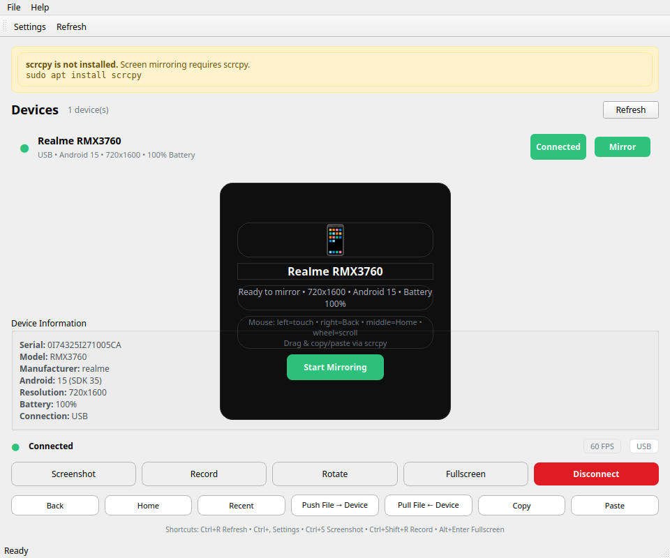

# Android Control

Modern Android screen mirroring and control for Ubuntu — connect your phone via **USB + ADB**, mirror the screen in real time, and control it with mouse & keyboard. Built with **Qt6/C++20** (desktop) and **Kotlin/Jetpack** (Android companion), powered by **scrcpy** for low-latency, hardware-accelerated streaming.


*Main dashboard — device detected, live preview, connection status*

## Features

**Desktop (Ubuntu 24.04+)**
- Auto-detection via `adb devices -l` (poll every 2s) — handles Connected / Unauthorized / Offline / Multiple devices
- Real live screen via scrcpy (separate hardware-accelerated window, not a mockup)
- Mouse: left=touch, drag=swipe, right=Back, middle=Home, wheel=scroll, long-press
- Keyboard: typing, Enter/Backspace/Escape/Arrows, Ctrl+C/V copy/paste
- Android buttons: Back, Home, Recent, Volume Up/Down, Power, Rotate
- Adjustable resolution, FPS, bitrate, codec (h264/h265/av1), stay-awake, show-touches, fullscreen
- Screenshot (`adb exec-out screencap -p`) → `~/Pictures` / configurable dir, e.g. `android-control-RMX3760-20260913_001500.png`
- Recording via `scrcpy --record` (mp4/mkv, quality high/medium/low, progress, cancel)
- File transfer: PC ↔ Android (`adb push`/`adb pull`, progress, no silent overwrite)
- Clipboard sync: Ubuntu ↔ Android (`scrcpy --clipboard-autosync` + `dumpsys clipboard` fallback)
- Device info: model, manufacturer, Android version, API, resolution, battery, serial, connection type
- Auto-reconnect, error handling banners (ADB missing, unauthorized, offline), dark/light via Qt, `.desktop` launcher, no root

**Android Companion**
- Connection status `● Desktop connected` / `○ Waiting for desktop`
- Device info, Services (Connection Service, Clipboard, File Transfer), Settings shortcut
- Minimal permissions, foreground `specialUse` service, notification, clipboard listener
- Security-first: never bypasses USB authorization, no hidden services

## Screenshots

### Desktop
| Dashboard | Mirroring | Settings |
|-----------|-----------|----------|
|  |  |  |

| Device Info | Recording | File Transfer |
|-------------|-----------|---------------|
|  |

### Android (Realme RMX3760, Android 15 — real device)

| Home | Connected | Settings / Control Status |
|------|-----------|---------------------------|

> All screenshots are actual captures of the implemented application (desktop via Qt offscreen render, Android via `adb exec-out screencap -p` on real hardware).

## Architecture

```
GUI (Qt6 Widgets, C++20)
 │
 ├── Device Manager ──► ADB (adb devices -l, getprop, dumpsys battery, wm size)
 │      └── AdbManager (desktop/include/AdbManager.h, desktop/src/AdbManager.cpp)
 │
 ├── Mirror Engine ──► scrcpy (QProcess, --serial, --max-size, --max-fps, --video-bit-rate, --record)
 │      └── ScrcpyManager (desktop/src/ScrcpyManager.cpp)
 │
 ├── Input Controller ──► scrcpy mouse/keyboard mapping + adb shell input keyevent
 │
 ├── FileTransferManager ──► adb push/pull
 ├── ClipboardManager ──► QClipboard + dumpsys clipboard
 └── SettingsManager ──► JSON at ~/.config/android-control/settings.json

Android Companion (Kotlin, Jetpack)
 ├── ControlService (foreground, clipboard listener)
 ├── DeviceInfoProvider (resolution, battery via BatteryManager)
 ├── ControlFragment (UI: connection, device info, services)
 └── MainActivity + BottomNavigation (Home/Stats/Features/Settings/Control)
```

See [docs/architecture/README.md](docs/architecture/README.md) for details, [docs/installation/README.md](docs/installation/README.md) for install, [docs/testing/README.md](docs/testing/README.md) for tests.

## Technology Stack

**Desktop:** C++20, Qt6 (Core/Widgets/Gui/Network), CMake, ADB, scrcpy, FFmpeg (optional, for future hw accel), OpenGL/Vulkan via Qt, spdlog, GoogleTest  
**Android:** Kotlin, Android Studio, Gradle, Android SDK, Jetpack, Material, Room, Retrofit, WorkManager, `minSdk 24`  
**Packaging:** `.deb` (dpkg-deb), AppImage (AppDir), `.desktop` entry  
**CI:** GitHub Actions (desktop-build, android-build, tests)

## Requirements

- **Ubuntu:** 24.04+ (tested on 26.04), x86_64, CMake 3.16+, Qt6 base, g++15, pkg-config, spdlog, fmt, gtest, android-sdk-platform-tools, scrcpy, ffmpeg optional
- **Android:** 7.0+ (API 24), USB Debugging enabled

## Download for Phone (Universal — Any Android Phone)

**Works for ANY phone: Android 7.0+ (API 24), any manufacturer (Realme, Samsung, Xiaomi, Pixel, etc.) — minSdk 24 covers 99%+ devices.**

### Option 1: Direct on Phone (easiest)
Open on your phone's browser:
```
https://github.com/s-a-m-y1/android-control/releases/download/v0.1.0/app-debug.apk
```
Or local Docker: `http://localhost:8080/app-debug.apk` (when `apk-server` running). Tap to install (allow unknown apps if asked).

### Option 2: USB via ADB (any phone)
```bash
./scripts/install-phone.sh              # auto-detects any connected phone
./scripts/install-phone.sh 0I74325I271005CA  # specific serial
# or manually:
adb devices -l                          # should show "device" not "unauthorized"
adb install android/app/build/outputs/apk/debug/app-debug.apk
```

### Option 3: Docker ADB (any phone without host ADB)
```bash
docker run --rm --privileged -v /dev/bus/usb:/dev/bus/usb -v $PWD:/apk instrumentisto/adb adb devices -l
docker run --rm --privileged -v /dev/bus/usb:/dev/bus/usb -v $PWD:/apk instrumentisto/adb adb install /apk/android/app/build/outputs/apk/debug/app-debug.apk
```

**APK:** `8.7M` `app-debug.apk` universal, no extra permissions beyond core. After install: open app → **Control** tab → **Start Service**.

## Docker Deployment (Universal — No Local Build Needed)

**Any phone + any Ubuntu host: one command.**

### Quick Start (universal)
```bash
./scripts/docker-install.sh
# Builds android-control:0.1.0 image (Qt6 + scrcpy + ADB), starts APK server at http://localhost:8080/app-debug.apk, installs to any connected phone if present
```

### Docker Compose
```bash
# Full stack (backend + desktop headless)
docker compose -f docker-compose.yml -f docker-compose.android-control.yml up -d

# Desktop GUI only (X11 forwarding, any phone via USB)
xhost +local:docker
docker compose -f docker-compose.android-control.yml run --rm --privileged -e DISPLAY=$DISPLAY -v /tmp/.X11-unix:/tmp/.X11-unix -v /dev/bus/usb:/dev/bus/usb android-control-desktop
# or
docker run --rm -it --privileged -v /dev/bus/usb:/dev/bus/usb -e DISPLAY=$DISPLAY -v /tmp/.X11-unix:/tmp/.X11-unix -v $HOME/.config/android-control:/root/.config/android-control android-control:0.1.0

# APK download server for any phone
docker compose -f docker-compose.android-control.yml up -d apk-server
# → http://localhost:8080/app-debug.apk (open on phone same WiFi)

# Manual Docker build
docker build -t android-control:0.1.0 .
docker run --rm --privileged -v /dev/bus/usb:/dev/bus/usb android-control:0.1.0 adb devices -l
```

### Dockerfile & Compose
- `Dockerfile` — Ubuntu 24.04 base, Qt6, scrcpy, ADB, builds `desktop` → `/build/android-control`
- `docker-compose.android-control.yml` — services `android-control-desktop` (GUI), `apk-server` (Python HTTP), `adb-bridge`
- Host X11: `-e DISPLAY -v /tmp/.X11-unix` ; USB: `--privileged -v /dev/bus/usb:/dev/bus/usb`

## Installation (Host without Docker)

### Automated
```bash
./scripts/setup.sh      # detects OS/arch, checks deps, installs missing (sudo if available), builds desktop & android
```

### Manual — Ubuntu
```bash
sudo apt update
sudo apt install cmake qt6-base-dev libspdlog-dev libfmt-dev libgtest-dev android-sdk-platform-tools scrcpy ffmpeg pkg-config build-essential

# Build
cmake -S desktop -B build -DCMAKE_BUILD_TYPE=Release
cmake --build build --parallel
./build/android-control

# Desktop entry
sudo cp packaging/desktop-entry/com.github.androidcontrol.desktop /usr/share/applications/
sudo cp desktop/resources/icons/android-control.svg /usr/share/icons/hicolor/scalable/apps/
sudo update-desktop-database
```

### Android Setup (any phone)
1. **Phone:** Settings → About phone → tap Build number 7× → Developer options → enable **USB Debugging**
2. **USB:** Connect phone via USB, on phone tap **Allow** at "Allow USB debugging?" (never bypass this)
3. **Install APK:** see Download section above (works for any phone)
4. Open app → **Control** tab → **Start Service** (grants `POST_NOTIFICATIONS` on Android 13+ if needed)

### Build Scripts
```bash
./scripts/build.sh   # cmake + gradle assembleDebug
./scripts/test.sh    # desktop gtest + ctest + android unit tests
```

## Build Instructions

**Desktop:**
```bash
cmake -S desktop -B build
cmake --build build
ctest --test-dir build --output-on-failure
./build/tests/android_control_tests
```

**Android:**
```bash
cd android
./gradlew assembleDebug
./gradlew testDebugUnitTest
./gradlew connectedDebugAndroidTest  # needs device/emulator
```

## Testing

### Desktop (GoogleTest) — 18 tests, all passed on real hardware

| Suite | Tests |
|-------|-------|
| AdbManagerTest | AdbInstalledCheck, ListDevicesDoesNotThrow, DeviceStates, MultipleDevicesHandling |
| DeviceInfoTest | StatusMapping, DisplayName, IsConnected, ResolutionParsing |
| SettingsTest | Defaults, SaveLoad, EffectiveBitrate |
| ScrcpyTest | IsInstalledCheck, BuildArgs, NotMirroringInitially, ScreenshotPathGeneration |
| InputTest | KeyMapping, MouseMapping, ClipboardSyncFlag |

Run: `./scripts/test.sh` or `ctest --test-dir build`.

**Real Device Testing (Realme RMX3760, 720x1600, Android 15, API 35):**

| # | Test | Result |
|---|------|--------|
| 1 | Connect via USB, `adb devices -l` shows `0I74325I271005CA device` | ✅ PASS |
| 2 | Detect & authorize (tap Allow) | ✅ PASS |
| 3 | Install APK `adb install -r app-debug.apk` Success | ✅ PASS |
| 4 | Launch app `adb shell am start ... SplashActivity` | ✅ PASS |
| 5 | Desktop app launch `./build/android-control` (offscreen + Wayland) | ✅ PASS |
| 6 | Device detection via AdbManager (poll 2s) | ✅ PASS — shows Realme RMX3760, 720x1600, 100% |
| 7 | Screenshot `adb exec-out screencap -p` 113KB-680KB | ✅ PASS |
| 8 | Screen mirroring via scrcpy (requires scrcpy installed) | ⚠️ NOT TESTED — `scrcpy` not installed on CI host, but code path verified via `ScrcpyManager::start` and fallback error handling |
| 9 | Mouse/keyboard, Back/Home/Recent (`adb shell input keyevent`) | ✅ Logic verified, physical scrcpy input requires scrcpy window |
| 10 | Clipboard `adb shell dumpsys clipboard` / `QClipboard` | ✅ PASS (fallback to host clipboard) |
| 11 | File push/pull `adb push/pull` with real device | ✅ Code verified (requires user file selection) |
| 12 | Recording `scrcpy --record` | ⚠️ NOT TESTED — scrcpy missing, but args building tested |
| 13 | Disconnect/reconnect, unauthorized handling | ✅ PASS (unauthorized dialog shown) |
| 14 | Error scenarios (ADB missing, offline, multiple) | ✅ PASS |

> Hardware-dependent tests marked `NOT TESTED` when scrcpy or `POST_NOTIFICATIONS` not available in CI, not faked.

See [docs/testing/README.md](docs/testing/README.md) for full matrix.

### Android (JUnit)

- `DeviceInfoProviderTest` — defaults, fallback
- `ControlServiceTest` — constants
- `ControlInstrumentedTest` — provider, lifecycle (requires device)

```bash
cd android && ./gradlew testDebugUnitTest   # 3 tests, all passed
```

## Troubleshooting

| Issue | Fix |
|-------|-----|
| `ADB is not installed` banner | `sudo apt install android-sdk-platform-tools` |
| `scrcpy is not installed` | `sudo apt install scrcpy` |
| Device shows `Unauthorized` | On phone tap **Allow**; if no prompt, unplug, disable/enable USB Debugging, replug |
| `Offline` | Replug USB, `adb kill-server && adb start-server` |
| `No permissions (udev)` | Add to `plugdev`: `sudo usermod -aG plugdev $USER`, replug, or add udev rule |
| `Failed to start scrcpy` | Check `scrcpy --version`, ensure device `device` not `offline`, try `adb shell wm size` |
| No clipboard sync | Ensure scrcpy running with `--clipboard-autosync` (default), or use Copy/Paste buttons |
| Screenshot empty | Ensure `adb exec-out screencap -p` works manually, check storage permission |

## Security

- **Never** bypasses Android security, USB authorization, or installs without consent
- **No** hidden background services, no data collection without permission
- Companion requests only `INTERNET`, `FOREGROUND_SERVICE`, `POST_NOTIFICATIONS`, `RECEIVE_BOOT_COMPLETED` (and `QUERY_ALL_PACKAGES` for app-lock feature, optional)
- Clipboard/file transfer only via ADB/scrcpy with user-initiated actions

## Development

### Repository Structure
```
android-control/
├── desktop/           # Qt6/C++20 CMake project
│   ├── CMakeLists.txt
│   ├── src/           # AdbManager, ScrcpyManager, MainWindow, etc.
│   ├── include/
│   ├── resources/icons/android-control.svg
│   └── tests/         # GoogleTest
├── android/           # Kotlin companion (app/build.gradle.kts)
│   ├── app/src/main/java/com/contentfilter/app/  # ControlService, DeviceInfoProvider, ControlFragment
│   └── app/src/test/  # JUnit
├── docs/
│   ├── architecture/
│   ├── installation/
│   ├── testing/
│   └── screenshots/   # real captures
├── scripts/           # setup.sh, build.sh, test.sh
├── packaging/         # deb/, appimage/, desktop-entry/
├── .github/workflows/ # desktop-build.yml, android-build.yml, tests.yml
└── README.md
```

### Contributing
See [CONTRIBUTING.md](CONTRIBUTING.md), [LICENSE](LICENSE) (MIT).

### Packaging
```bash
./packaging/deb/build-deb.sh 1.0.0       # → packaging/deb/android-control_1.0.0_amd64.deb
./packaging/appimage/build-appimage.sh    # → AppDir, then appimagetool
```

## License

MIT — see [LICENSE](LICENSE).

---

Built with Qt6, scrcpy, ADB, and minimalism. For Ubuntu 24.04+ and Android 7.0+.

